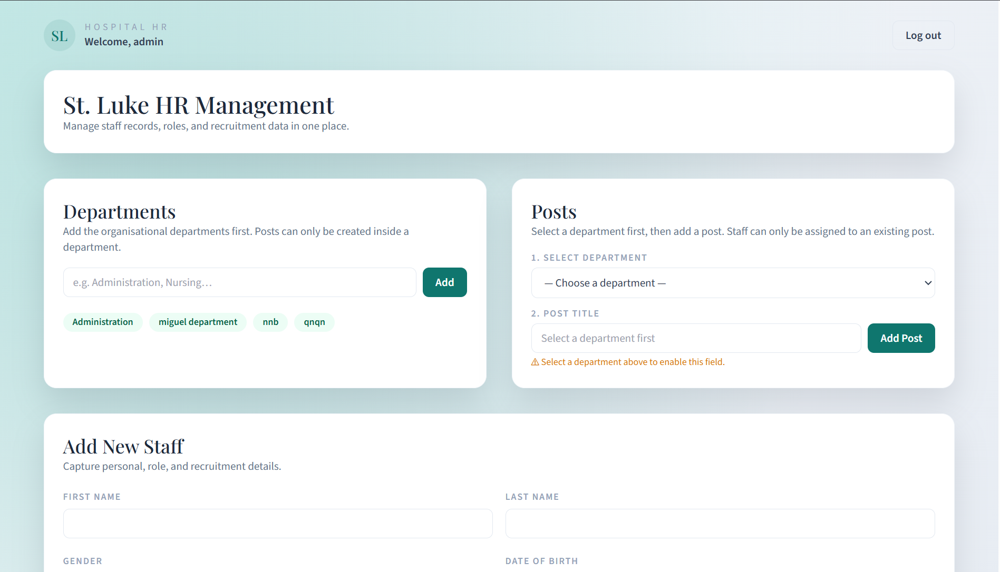

# 🏥 St. Luke HR Management System (HRMS)

<p align="center">
  
</p>


## 🏥 Overview
A modern, session-based Human Resource Management System tailored for hospital environments. This system allows administrators to manage organizational structures (Departments and Posts) and maintain detailed records of staff members, including their employment history and role assignments.

---

## 🚀 Technology Stack

### Frontend
- **React.js**: Core UI framework.
- **Vite**: Ultra-fast build tool and development server.
- **Axios**: Promised-based HTTP client for API communication.
- **Vanilla CSS**: Custom, premium styling with glassmorphism effects and modern aesthetics.

### Backend
- **Node.js & Express**: Scalable backend server architecture.
- **MySQL**: Relational database for structured data storage.
- **Express-Session**: Secure, cookie-based session management.
- **Bcrypt**: For robust password hashing and security.
- **MySQL2/Promise**: Asynchronous database interaction.

---

## 📂 Project Structure

```text
hrms-codebase/
├── hr-backend/             # Express.js Server
│   ├── db/                 # Database schema scripts
│   ├── scripts/            # Setup and utility scripts
│   ├── src/
│   │   ├── middleware/     # Authentication guards
│   │   ├── routes/         # API endpoints (Auth, Staff, Meta)
│   │   ├── utils/          # DB Initialization logic
│   │   ├── db.js           # Connection pool configuration
│   │   └── index.js        # Server entry point
│   └── .env                # Backend configuration
├── hr-frontend/            # React + Vite Frontend
│   ├── src/
│   │   ├── components/     # Reusable UI components
│   │   ├── App.jsx         # Main application logic
│   │   ├── index.css       # Core design system
│   │   └── main.jsx        # Frontend entry point
│   └── vite.config.js      # Proxy and build settings
└── .gitignore              # Global git exclusions
```

---

## 🛠 Core Features & Logic

### 1. 🔐 Authentication & Security
- **Secure Login**: Session-based authentication using cookies.
- **Password Protection**: Passwords are never stored in plain text; they are hashed using `bcrypt` before database entry.
- **Session Persistence**: Automated session management that preserves user state across page refreshes.
- **Transparent Logout**: Fully destroys server sessions and clears client-side cookies for a secure exit.

### 2. ⚡ Database Auto-Initialization
The system is designed for a "zero-configuration" start:
- On every server start, the system checks if the target database exists.
- If missing, it automatically creates the database and all necessary tables.
- It bootstraps a default **System Admin** account and an **Administration** department to ensure immediate accessibility.

### 3. 🏢 Organization Management
- **Department Hierarchy**: Create and manage organizational departments first.
- **Post/Role Dependency**: Posts are created within specific departments, maintaining structural integrity.
- **Visual Clues**: UI guides the user through the process, ensuring no orphaned roles are created.

### 4. 👥 Staff Management & Advanced Filters
- **Complete Professional Profiles**: Capture Name, Contact, DOB, Salary, and Hire Date.
- **Smart Filtering**:
    - Filter by **Department** to see specific medical or administrative units.
    - Filter by **Post** (automatically scoped to the selected department).
    - Filter by **Hire Date Range** to track recruitment history.
- **Live Updates**: Real-time record count and dynamic table updates.

### 5. ✨ User Experience
- **Toast Notifications**: Modern, glass-effect pop-up notifications for all actions (Success/Error).
- **Responsive Design**: Clean, card-based layout that adapts to various screen sizes.
- **Intuitive Navigation**: A seamless flow from login to organizational setup to staff management.

---

## ⚙️ Quick Start

### 1. Prerequisites
- MySQL Server installed and running.
- Node.js (Latest LTS recommended).

### 2. Backend Setup
1. Navigate to `/hr-backend`.
2. Configure your `.env` file (Database credentials, Port, etc.).
3. Run `npm install` to load dependencies.
4. Run `npm run dev` to start the server (Database will auto-initialize).

### 3. Frontend Setup
1. Navigate to `/hr-frontend`.
2. Run `npm install`.
3. Run `npm run dev`.
4. Access the system at `http://localhost:5173`.

**Default Login:**
- **Username:** `admin`
- **Password:** `admin123`

---

## 🧠 System Logic Details
- **Data Integrity**: Uses foreign key constraints (CASCADE/RESTRICT) to ensure that deleting a department doesn't leave orphaned posts or staff records by mistake.
- **Proxy Configuration**: Frontend uses a Vite proxy to communicate with the backend on `/api`, eliminating CORS issues during development.
- **Unified Design System**: Styling is driven by a custom CSS utility system defined in `index.css`, ensuring a consistent "premium" feel across every component.
